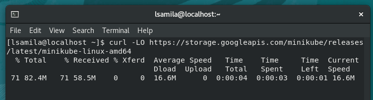
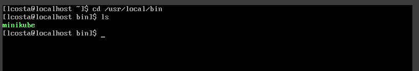
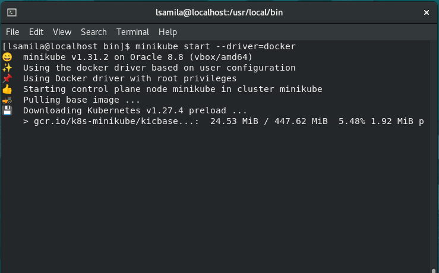

## Desafio 01 - Trilha DevSecOps na CompassUOL - Sprint 3


## Neste desafio farei a instalação do minikube para usar o Kubernetes
### Pré-requisitos:
- VM com Oracle Linux 8
- 2 CPUs
-  Aproximadamente 20gb de disco 

 

## Instalação minikube

### Instalar a versão mais estável do **minikube**, para **Linux x86-64**, usando **download binário**.

[Download minikube outras versões SO](https://minikube.sigs.k8s.io/docs/start/)

```
curl -LO https://storage.googleapis.com/minikube/releases/latest/minikube-linux-amd64
sudo install minikube-linux-amd64 /usr/local/bin/minikube
```


### Vá para o diretório **/usr/local/bin**



### Dê permissão ao usuario para usar o DOCKER
```
sudo usermod -aG docker $USER && newgrp docker
```
### Iniciar o **Minikube** usando o driver do **Docker**
```
minikube start --driver=docker
```


**Tornar o docker o driver padrão:**
```
minikube config set driver docker
```

## Intereja com o Cluster

### Baixe a versão apropriada do **kubectl**
```
minikube kubectl -- get po -A
```

1. Se você já tem **kubectl** instalado:
```
kubectl get po -A
```