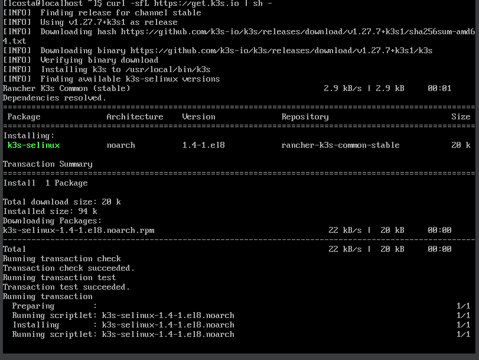
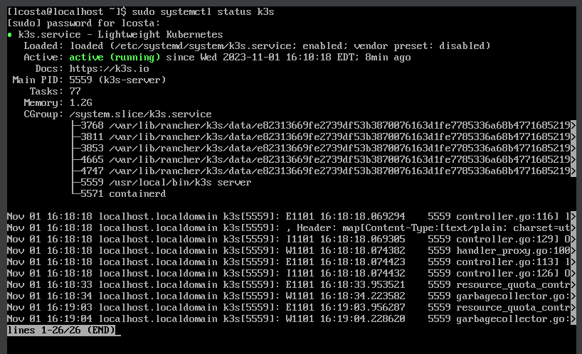
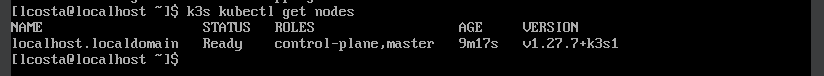

## Desafio 01 - Trilha DevSecOps na CompassUOL - Sprint 3


## Neste desafio farei a instalação do K3s para usar o Kubernetes
**K3s é uma distribuição multifuncional que pode ser usada em qualquer ambiente.**
### Pré-requisitos:
- VM com Oracle Linux 8

## Instalação K3s

[K3s Guide](https://docs.k3s.io/quick-start)

1. Isso fará o download do binário e registrará um serviço do sistema para que o K3s seja iniciado automaticamente quando o host for reinicializado:
```
curl -sfL https://get.k3s.io | sh -s - --write-kubeconfig-mode 644
```



### Verifique o status do k3s
```
sudo systemctl status k3s
```


## Interaja com o Cluster

1. Use o comando para interagir com seu cluster com a versão empacotada do Kubectl:
```
 sudo k3s kubectl get nodes
```
